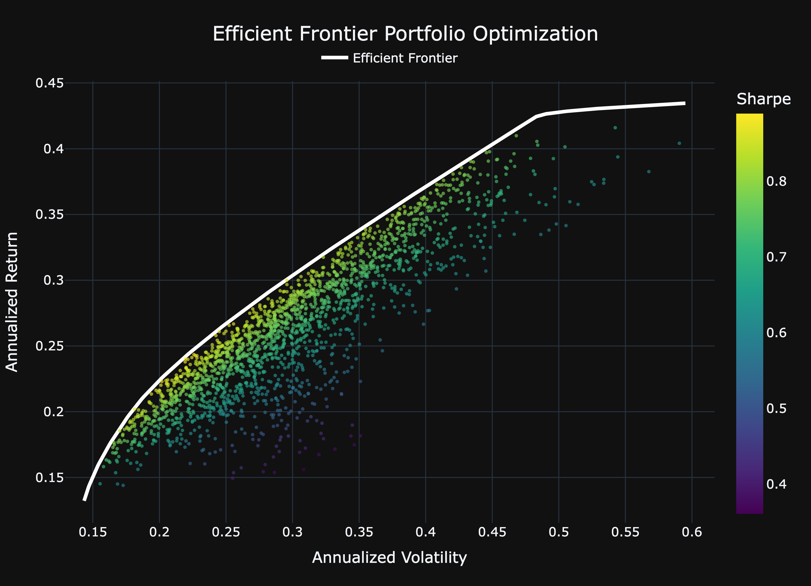

# Efficient Frontier and Portfolio Optimization 
Build an visualize optimized investment portfolios using Modern Portfolio Theory, Monte Carlo simulation, and convex optimization.
## Features 
- Retrieves historical stock and Treasury yield data from Alpha Vantage 
- Caches data locally to reduce API calls 
- Automatically refreshes outdated market data
- Simulates thousands of portfolios using Monte Carlo Methods
- Constructs an Optimized Efficient Frontier using CVXPY
- Calculates annualized returns, volatility, and Sharpe ratios 
- Generates interactive Plotly visualizations
- Provides mock data for development and testing 
- Includes 60+ automated unit tests
## Overview 
This project allows a user to input any valid stock tickers, and retrieve the historical data necessary to construct and visualize an Efficient Frontier. The program performs this by building and visualizing optimized investment portfolios using Modern Portfolio Theory, Monte Carlo Simulations, and convex optimization.

The final output is an interactive visualization containing thousands of simulated portfolios alongside the optimized Efficient Frontier.
## Tech Stack 

- Python
- Pandas
- NumPy
- CVXPY
- Plotly
- Alpha Vantage API
- Pytest
- unittest
- responses
## Project Structure 
### Architecture
```
User Input
    ↓
CSV Cache Check
    ↓
Missing/Outdated Tickers? 
    ↓
Alpha Vantage API 
    ↓
Data Cleaning
    ↓
Data Alignment
    ↓
Return Calculations 
    ↓
Monte Carlo Simulation
    ↓
CVXPY Optimization
    ↓
Plotly Visualization
```
### File Structure 
```
Project
    ├── main.py             # App entry
    ├── data.py             # Data ingestion & storage
    ├── api.py              # Alpha Vantage integration
    ├── fake_data.py        # Mock data provider 
    ├── portfolio.py        # Portfolio calculations & optimization
    ├── graphs.py           # Plotly vizualization
    ├── requirements.txt
    └── test_folder
        ├── __init__.py
        ├── test_api.py
        ├── test_data.py
        ├── test_graphs.py
        ├── test_main.py
        └── test_portfolio.py
```
## Installation
To install all packages needed to run this program run
`pip install -r requirements.txt`

Also, retrieve an API key from: [https://www.alphavantage.co/support/#api-key].
 
Store your API key as this evironment variable 
`export STOCK_API_KEY1="Your_api_key_here"`

Run program with:
`python main.py`
## Usage 
Enter tickers one at a time: 
```
Ticker: AAPL
Ticker: TSLA
Ticker: AMD
Ticker: SPY
```

Press **Ctrl + d** when finished entering tickers.
> This will raise an `EOFError` that will be caught as a signal to continue with the program.

The application will then: 

1. Check for cached data
2. Retrieve missing or outdated market data 
3. Align historical values
4. Calculate annual financial metrics and descriptive statistics
5. Generate Monte Carlo Portfolios 
6. Construct the Efficient Frontier 
7. Display an interactive Plotly visualization

### Customization
The criteria used to determine outdated market data can easily be modified to retain data for longer periods. 

Similarly, several parameters in the project can be adjusted to analyze assets using different assumptions while preserving overall workflow. 
### Example Output 



## Testing 
**The project contains over 60 automated unit tests covering:**

- Data ingestion
- CSV persistence
- API handling
- Portfolio calculations
- Optimization Logic
- Visualization

**Tools:**

- pytest
- unittest
- unittest.mock
- responses
## Development Notes 
To minimize API rate limits during development and testing, the project includes a `FakeData` class that mirrors the interface used by `CallApi`.

Since both classes expose the same methods, they can be substituted without modifying downstream code.

`missing_t = FakeData(tickers_to_upd)`

or 

`missing_t = CallApi(tickers_to_upd)`
## Feedback and Contributions 

Feedback, suggestions, and criticism are always welcome.

If you find a bug, have any ideas for new features, or want to share a better way to approach an implementation, feel free to open an issue or start a discussion. I am really always interested in learning from different perspectives. 

If you would like to contribute please submit a pull request after forking the repository and making your changes. Please include a clear description of the proposed improvement(s). 

## About 
I'm Jalen Buffert and I developed this tool to better understand how to build dynamic and maintainable systems. With a Bachelor's degree in Economics, I have already had exposure to financial data analysis. Since graduation, my interest in software development has deepened. I enjoy building software that makes exploring financial concepts and quantitative methods more accessible. 

This project originally began as an idea focused on portfolio returns and visualization, but it expanded as I encountered real-world issues related to financial data retrieval, API rate limits, data alignment, optimization, and testing. The project evolved into a modular system separated across multiple files constructed to make handling these issues easier. The application has been intentionally separated into modules to improve maintainability and readability.
